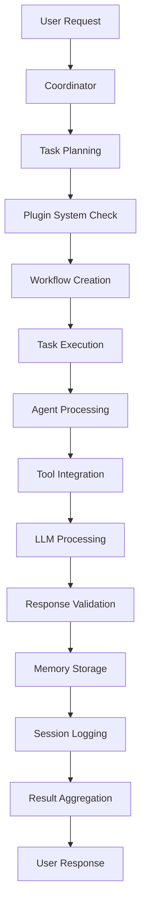
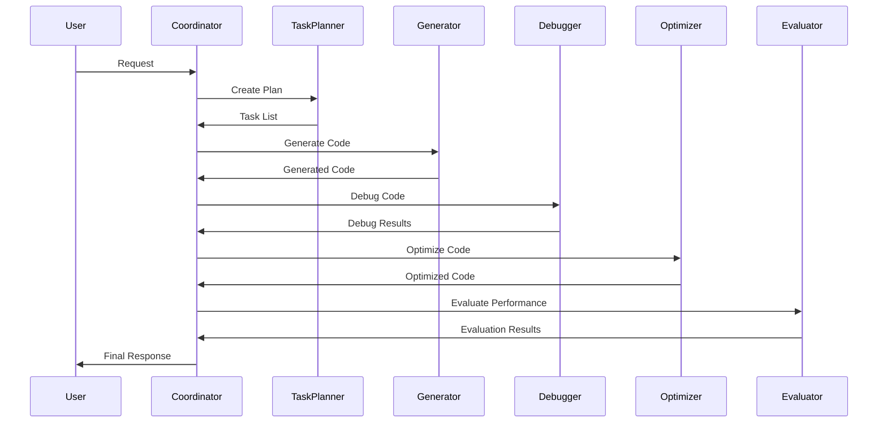

# Pinocchio System Architecture

This document provides a comprehensive overview of the Pinocchio multi-agent CUDA programming system architecture, including component designs, data flows, and interaction patterns.

## Table of Contents

- [System Overview](#system-overview)
- [Core Components](#core-components)
- [Agent Architecture](#agent-architecture)
- [Tools Integration](#tools-integration)
- [Data Flow](#data-flow)
- [Configuration System](#configuration-system)
- [Plugin Architecture](#plugin-architecture)
- [Memory & Knowledge Management](#memory--knowledge-management)

## System Overview

Pinocchio follows a layered architecture with clear separation of concerns:

```
┌─────────────────────────────────────────────────────────────┐
│                     Presentation Layer                     │
│  ├── CLI Interface         ├── API Endpoints              │
│  └── Web Interface         └── Direct Python API          │
├─────────────────────────────────────────────────────────────┤
│                    Coordination Layer                      │
│  ├── Coordinator           ├── Task Planning              │
│  ├── Session Management    └── Workflow Orchestration     │
├─────────────────────────────────────────────────────────────┤
│                       Agent Layer                          │
│  ├── Generator Agent       ├── Optimizer Agent            │
│  ├── Debugger Agent        └── Evaluator Agent            │
├─────────────────────────────────────────────────────────────┤
│                       Tools Layer                          │
│  ├── CUDA Debug Tools      ├── Performance Eval Tools     │
│  └── MCP Tool Integration  └── External Tool Interfaces   │
├─────────────────────────────────────────────────────────────┤
│                     Services Layer                         │
│  ├── Memory Manager        ├── Knowledge Base             │
│  ├── Plugin System         └── Prompt Manager             │
├─────────────────────────────────────────────────────────────┤
│                   Infrastructure Layer                     │
│  ├── LLM Clients          ├── Configuration Management    │
│  ├── Session Logging      └── Storage Backends            │
└─────────────────────────────────────────────────────────────┘
```

## Core Components

### 1. Coordinator (`pinocchio/coordinator.py`)

The central orchestrator that manages the entire system lifecycle.

**Responsibilities:**
- Request processing and routing
- Agent lifecycle management
- Session coordination
- Task planning and execution
- Result aggregation

**Key Methods:**
```python
class Coordinator:
    async def process_request(self, request: Dict[str, Any]) -> Dict[str, Any]
    def _create_task_plan(self, request: Dict[str, Any]) -> List[Task]
    def _initialize_components(self) -> None
    def _create_workflow_plan(self, request: Dict[str, Any]) -> Optional[List[Task]]
```

**Integration Points:**
- Connects to all agents
- Manages plugin system
- Interfaces with memory and knowledge systems
- Handles session logging

### 2. Task Planning System (`pinocchio/task_planning/`)

Intelligent task decomposition and scheduling system.

**Components:**
- `TaskPlanner`: Creates execution plans from user requests
- `TaskExecutor`: Executes planned tasks with dependency management
- `Task`: Individual task representation with metadata

**Task Lifecycle:**
```
Request → Analysis → Planning → Scheduling → Execution → Results
```

**Task Types:**
- `generate`: Code generation tasks
- `debug`: Error detection and fixing
- `optimize`: Performance optimization
- `evaluate`: Performance analysis

### 3. Session Management (`pinocchio/session/`)

Comprehensive session and state management.

**Features:**
- Session creation and lifecycle management
- State persistence and restoration
- Conversation history tracking
- Cross-session memory management

**Session Structure:**
```json
{
  "session_id": "uuid",
  "created_at": "timestamp",
  "status": "active|completed|failed",
  "conversation_history": [],
  "agent_interactions": {},
  "performance_metrics": {},
  "results": {}
}
```

## Agent Architecture

All agents inherit from the base `AgentWithRetry` class, providing:

- Unified retry mechanisms
- Error handling patterns
- LLM integration
- Prompt management
- Response validation

### Agent Hierarchy

```
AgentWithRetry (Base)
├── GeneratorAgent
├── OptimizerAgent
├── DebuggerAgent
└── EvaluatorAgent
```

### 1. Generator Agent (`pinocchio/agents/generator.py`)

**Purpose**: Generate CUDA code from high-level specifications

**Key Features:**
- CUDA-specific code generation
- Template-based generation for common patterns
- Context-aware prompt engineering
- Real code output (not pseudocode)

**Prompt Structure:**
```
System Context: CUDA Programming Expert
User Request: Code specification
Context: Target architecture, optimization goals
Templates: Available CUDA patterns
Output Format: Structured JSON with actual code
```

### 2. Optimizer Agent (`pinocchio/agents/optimizer.py`)

**Purpose**: Optimize existing CUDA code for performance

**Optimization Categories:**
- Memory access optimization
- Occupancy improvements
- Register usage optimization
- Memory coalescing
- Shared memory optimization

**Analysis Process:**
1. Code pattern recognition
2. Bottleneck identification
3. Optimization strategy selection
4. Code transformation
5. Performance estimation

### 3. Debugger Agent (`pinocchio/agents/debugger.py`)

**Purpose**: Identify and fix CUDA code issues

**Debugging Capabilities:**
- Syntax error detection
- Compilation error analysis
- Runtime error identification
- Memory access violations
- Logic error detection

**Tool Integration:**
- CUDA compiler (nvcc)
- Memory checker (cuda-memcheck)
- Syntax validator
- Static analysis tools

### 4. Evaluator Agent (`pinocchio/agents/evaluator.py`)

**Purpose**: Analyze CUDA code performance characteristics

**Evaluation Areas:**
- Theoretical occupancy analysis
- Memory bandwidth utilization
- Computational efficiency
- Scalability assessment
- Bottleneck identification

**Tool Integration:**
- Performance profiler (nvprof/nsys)
- Occupancy calculator
- Performance analyzer
- Metrics collection

## Tools Integration

The MCP (Model Context Protocol) tools system provides external tool integration.

### Tool Architecture

```
ToolManager
├── CudaDebugTools
│   ├── CudaCompilerTool
│   ├── CudaMemcheckTool
│   └── CudaSyntaxChecker
└── CudaEvalTools
    ├── CudaProfilerTool
    ├── CudaOccupancyCalculator
    └── CudaPerformanceAnalyzer
```

### Tool Execution Flow

```
Agent Request → Tool Manager → Specific Tool → External Process → Result Processing → Agent Response
```

### Tool Integration Points

**Debugger Agent Integration:**
```python
# Run debugging tools if CUDA code is present
tool_results = self._run_debugging_tools(cuda_code, context)
# Enhance prompt with tool results
prompt = f"{prompt}\n\nDEBUGGING TOOL RESULTS:\n{tool_summary}"
```

**Evaluator Agent Integration:**
```python
# Run evaluation tools
tool_results = self._run_evaluation_tools(cuda_code, context)
# Include performance metrics in analysis
prompt = f"{prompt}\n\nPERFORMANCE EVALUATION RESULTS:\n{tool_summary}"
```

## Data Flow

### Request Processing Flow



### Agent Interaction Flow



## Configuration System

### Configuration Hierarchy

```
pinocchio.json (Main Config)
├── LLM Configuration
├── Agent Settings
├── Plugin Configuration
├── Tools Configuration
├── Storage Settings
├── Workflow Configuration
└── Debug/Logging Settings
```

### Configuration Loading

```python
class ConfigManager:
    def __init__(self, config_path: str = "pinocchio.json")
    def get(self, key: str, default: Any = None) -> Any
    def get_agent_llm_config(self, agent_type: str) -> Dict[str, Any]
    def validate_config(self) -> bool
```

### Environment Variable Support

Configuration values can be overridden with environment variables:
- `LLM_PROVIDER`: Override LLM provider
- `LLM_API_KEY`: Override API key
- `DEBUG_LEVEL`: Override debug verbosity
- `STORAGE_PATH`: Override storage location

## Plugin Architecture

### Plugin System Design

```
PluginManager
├── Plugin Discovery
├── Plugin Loading
├── Plugin Validation
└── Plugin Execution
```

### Plugin Types

1. **Prompt Plugins**: Custom prompt engineering
2. **Workflow Plugins**: Custom execution workflows
3. **Agent Plugins**: Agent behavior extensions
4. **Tool Plugins**: External tool integrations

### Plugin Interface

```python
class Plugin(ABC):
    def __init__(self, name: str, description: str)

    @abstractmethod
    def initialize(self, config: Dict[str, Any]) -> bool

    @abstractmethod
    def execute(self, **kwargs) -> Any

    @abstractmethod
    def cleanup(self) -> None
```

### Plugin Configuration

```json
{
  "plugins": {
    "enabled": true,
    "plugins_directory": "./plugins",
    "active_plugins": {
      "prompt": "cuda_prompt_plugin",
      "workflow": "json_workflow_plugin",
      "agent": "custom_agent_plugin"
    },
    "plugin_configs": {
      "cuda_prompt_plugin": {
        "expertise_level": "expert",
        "target_domain": "CUDA"
      }
    }
  }
}
```

## Memory & Knowledge Management

### Memory System Architecture

```
MemoryManager
├── Session Memory (Short-term)
├── Agent Memory (Agent-specific)
├── Cross-Session Memory (Long-term)
└── Memory Indexing & Search
```

### Knowledge System Architecture

```
KnowledgeManager
├── CUDA Knowledge Base
├── Best Practices Repository
├── Code Pattern Library
└── Performance Optimization Database
```

### Memory/Knowledge Integration

```python
class PromptManager:
    def integrate_memory_and_knowledge(self, memory_manager, knowledge_manager)
    def create_context_aware_prompt(self, base_prompt: str, keywords: List[str]) -> str
    def format_template_with_context(self, template: str, context: Dict[str, Any]) -> str
```

### Context Enrichment Flow

```
User Request → Keyword Extraction → Memory Query → Knowledge Query → Context Assembly → Prompt Enhancement
```

## Error Handling & Resilience

### Error Categories

1. **Configuration Errors**: Invalid config, missing API keys
2. **LLM Errors**: API failures, timeout issues
3. **Tool Errors**: Missing dependencies, execution failures
4. **Agent Errors**: Processing failures, validation errors
5. **System Errors**: Storage issues, resource constraints

### Retry Mechanisms

```python
class AgentWithRetry:
    async def _call_llm_with_retry(self, prompt: str) -> Dict[str, Any]:
        for attempt in range(self.max_retries + 1):
            try:
                return await self.llm_client.complete(prompt)
            except Exception as e:
                if attempt < self.max_retries:
                    await asyncio.sleep(self.retry_delay * (2 ** attempt))
                else:
                    raise
```

### Fallback Strategies

- **LLM Fallback**: Switch to backup LLM provider
- **Tool Fallback**: Use alternative tools or static analysis
- **Agent Fallback**: Simplified processing modes
- **Data Fallback**: Use cached or template responses

## Performance Considerations

### Optimization Strategies

1. **Parallel Processing**: Concurrent agent execution where possible
2. **Caching**: Memory and knowledge caching
3. **Lazy Loading**: On-demand component initialization
4. **Connection Pooling**: Reuse LLM connections
5. **Result Caching**: Cache expensive computations

### Resource Management

- **Memory Management**: Automatic cleanup of temporary resources
- **Connection Management**: Proper LLM client lifecycle
- **Storage Management**: Efficient session and memory storage
- **Tool Management**: Resource cleanup after tool execution

## Security Considerations

### Input Validation

- Request sanitization
- Code injection prevention
- Configuration validation
- File path validation

### Data Protection

- Session data encryption
- API key management
- Temporary file cleanup
- Access control

### Tool Security

- Sandboxed tool execution
- Resource limits
- Timeout enforcement
- Output sanitization

## Monitoring & Observability

### Logging System

```python
class SessionLogger:
    def log_agent_activity(self, agent_type: str, action: str, data: Dict[str, Any])
    def log_system_event(self, event_type: str, details: Dict[str, Any])
    def log_performance_metrics(self, metrics: Dict[str, Any])
```

### Metrics Collection

- Agent performance metrics
- Tool execution metrics
- LLM response times
- System resource usage
- Error rates and patterns

### Debug Information

- Detailed execution traces
- Agent interaction logs
- Tool execution logs
- Configuration snapshots
- Session state dumps

---

This architecture provides a robust, scalable, and maintainable foundation for the Pinocchio multi-agent CUDA programming system, with clear separation of concerns and extensible design patterns.
